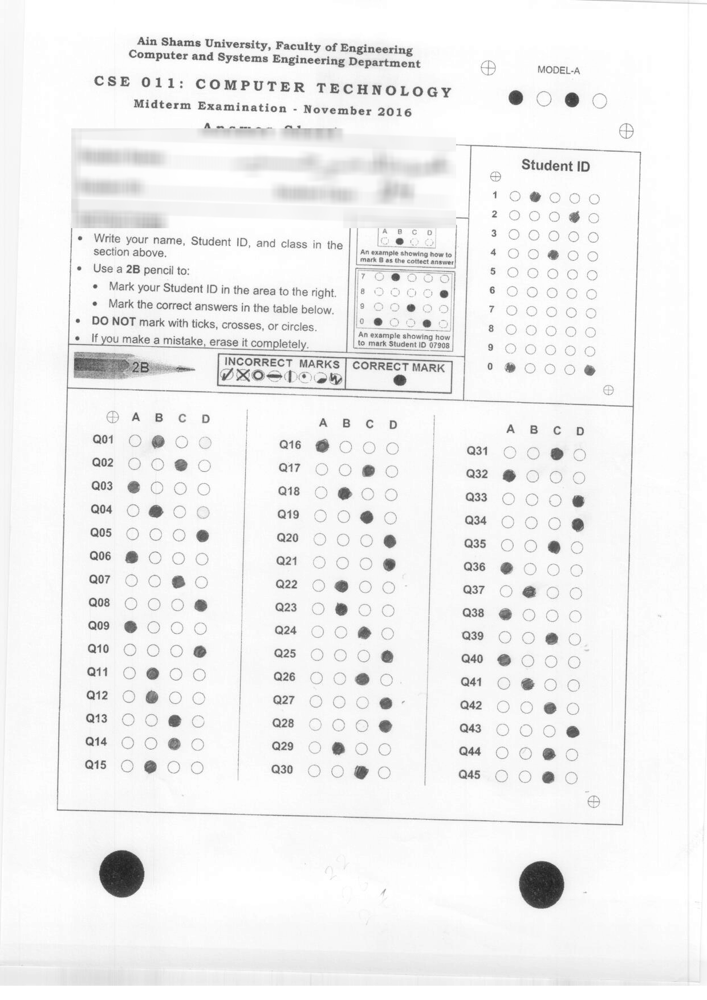

# Bubble sheet corrector

### Description:
Bubble sheet is a special form used in multiple-choice question examinations, that's corrected automatically using optical mark recognition by image processing techniques.

This project is created as senior year image processing course for correcting a specific exam, that has the following form 45 questions, each one have 4 possible choices.

---

### Requirements to run:

1. Python 3
2. Opencv 3.x
3. The data set, download from [here](https://inclass.kaggle.com/c/cse-464-mcqcorrector).

---

### Sample file

---

### Assumptions:

1. Papers are scanned with almost correct orientation ( may be rotated less than 45 degrees).

---
### Algorithm steps (1st Approach):

1. Use hough circle transform to detect the two big black circles at the bottom, then fix the rotation.
2. Use template matching to match the circles with cross inside it, then use them to crop the answers section.
3. Try to find the contours of the whole possible choices (180 one in this case) by a set  operations
    1. Gaussian blur the image (optional).
    2. Get edges via canny
    3. Use morphological opening to remove vertical lines as they are so common.
    4. Dilate the edges to complete them as full circles.
    5. Find all contours in the image.
    6. Filter the contours according to specific parameters, to get only the choices contours.
4. Sort the contours and cluster them 4 for each question.
5. Find which contour is the most filled one and consider it as answer. (Note: the implementation must change to take into consideration a few special cases.)

---
### Algorithm steps (2nd Approach):

1. Convert image to grayscale
2. Use gaussian kernel to blur image and remove noise.
3. Use hough circle transform to detect the two big black circles at the bottom, then fix the rotation.
4. Use template matching to match the circles with cross inside it, then use them to crop the answers section.
5. Use OTSU Thresholding on cropped section.
6. Crop each question using question coordinated since they are always the same after the rotation and cropping steps.
7. Foreach question in paper:
    1. Closing.
    2. Crop vertically to 4 equal parts.
    3. Foreach answer in question get number of dark pixels
    4. Get average darkness in question then calculate number of chocies that is above this average.
    5. If only one choice is above average then this is the answer and check if it is right or wrong, but if more than one choice is            above average the question gets a zero.
